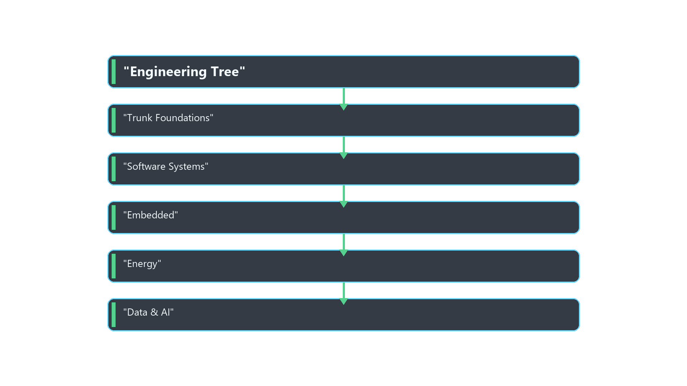
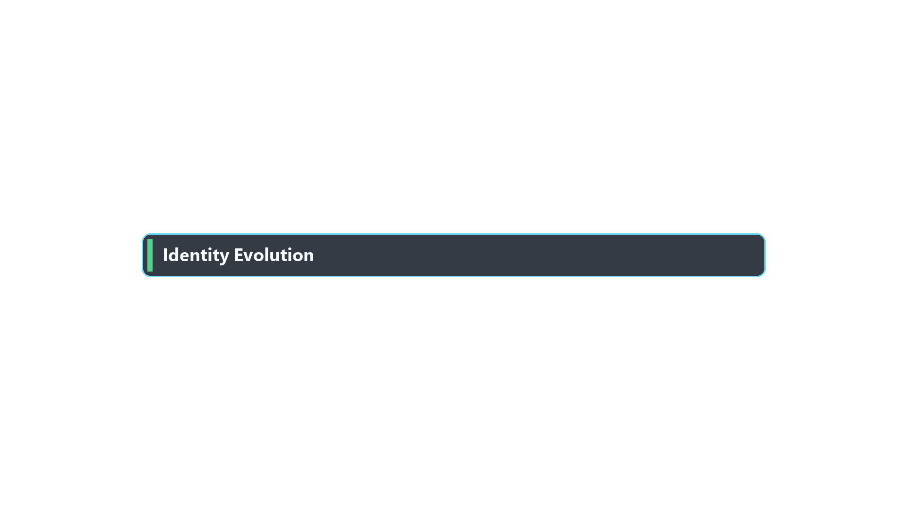

# Engineering Tree Community
*Powered by EruditeWBT*

A builder ecosystem designed to transform curiosity into **engineering power and income**.

Want the civilization-scale map of occupations + industries + tools?

- Civilization Graph Community: https://eruditewbt.github.io/Tech_Community_by_EruditeWBT/
- Graph viewer: https://eruditewbt.github.io/Tech_Community_by_EruditeWBT/graph.html

---

## Vision

Most people learn technology by consuming tutorials.

But civilization is built by **engineers who create systems**.

This community exists to help people move from:

User → Builder → Engineer → Architect → Founder.

---

## The Engineering Tree

Everyone begins with a shared foundation.

Then members branch into:

- Software Systems
- Embedded & Hardware
- Data & AI
- Energy & Automation

Every branch leads to:

projects → proof → monetization → opportunity.

---

## Identity Evolution

Members progress through stages:

Explorer → Apprentice → Builder → Engineer → Architect → Founder.

---

## Monetization Path

Skills become income through:

Freelancing → Consulting → Products → Startups.

---

## Start Here

1. Read the Manifesto  
   `manifesto/BUILDER_MANIFESTO.md`
2. Understand the Tree  
   `tree_v0/ENGINEERING_TREE_V0.md`
3. Introduce Yourself  
   `builders/profile_template.md`
4. Start a Project  
   `projects/project_template.md`

---

## Community

- Discord: https://discord.gg/8e4bQNknA
- Website (GitHub Pages): https://eruditewbt.github.io/engineering-tree-community_repo/
- Knowledge Hub: (Notion/GitBook)
- YouTube: https://www.youtube.com/@eruditewbt
- LinkedIn (Founder): https://www.linkedin.com/in/chemiosis-daniel-34542826a

---

## Philosophy

We reject passive learning.

We believe in:

- building real systems
- documenting knowledge
- teaching forward
- creating economic opportunity

Builders build.
